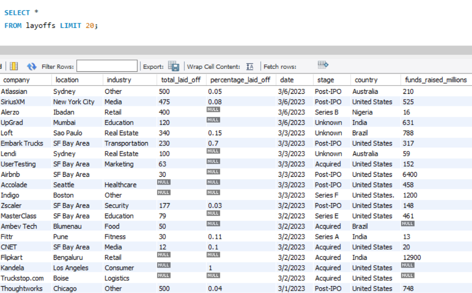
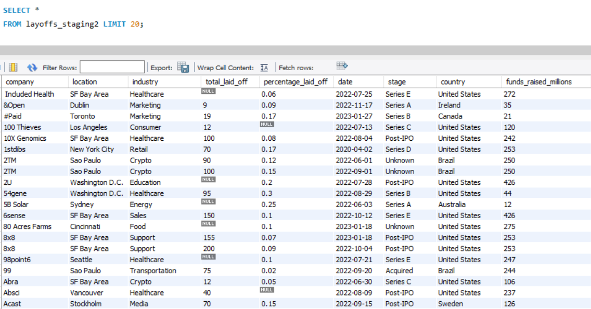

# MySQL Data Cleaning Project – Layoffs Dataset

## Overview
This project focuses on cleaning and standardizing a real-world layoffs dataset using **MySQL**.  
The goal was to transform raw, inconsistent data into a structured and analysis-ready format while preserving data integrity.

---

## Dataset
- **Source:** Layoffs data (raw CSV)
- **Raw table:** `layoffs`
- **Cleaning tables:** `layoffs_staging`, `layoffs_staging2`

The raw data contained:
- NULL and missing values
- Inconsistent text fields
- Unstandardized date formats
- Duplicate and messy records

---

## Tools Used
- **MySQL**
- **MySQL Workbench**

---

## Data Cleaning Steps
The following cleaning operations were performed using SQL:

- Removed duplicate records using window functions
- Standardized text fields (industry, stage, country, location)
- Converted dates into a uniform `YYYY-MM-DD` format
- Handled NULL values without introducing artificial data
- Ensured correct data types for numeric columns
- Created staging tables to preserve raw data

> Note: NULL values were intentionally retained where data was genuinely unavailable to avoid introducing bias.

---

## Before vs After
### Before Cleaning
Raw, uncleaned data with inconsistencies and missing values.

### After Cleaning
Cleaned, standardized, and analysis-ready data.

---

## 👤 Author
**Shruti Singh** 
- GitHub: https://github.com/Shrutiji007  
- LinkedIn: https://www.linkedin.com/in/shruti-singh-7a599030b

